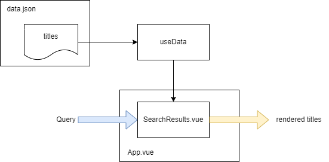

# File based


A file based data source is the simplest way to get started. It's also the easiest to maintain and update.
You can find an example in the assets/data directory. Data.json contains sample data that we will use to search through.

Example of the data:
```json
{
  "Name": "Setting Up your First Vue3 Project - Vue 3.0 Release",
  "Page": "https://learnvue.co/2020/09/setting-up-your-first-vue3-project-vue-3-0-release/"
}
```
The data will be loaded into a composable, in this example useData.js, and exposed to the user via a search bar.

## Use the composable 
`📄 src/composables/useData.js` to get the data from a central point. 
This way we don't care what the actual source of the data is.
To use the data you can import the composable:
```javascript
    import useData from "../composables/useData";
    const { filteredTitles } = useData();
```
If in the future, you transfer the data to a database or maybe an external API call, you can leave the data usage as before. 

> Note: The data is not reactive, so if you want to update the data, you will need to reload the page.
> If you want to make the data reactive, you can use a computed property to get the data.
